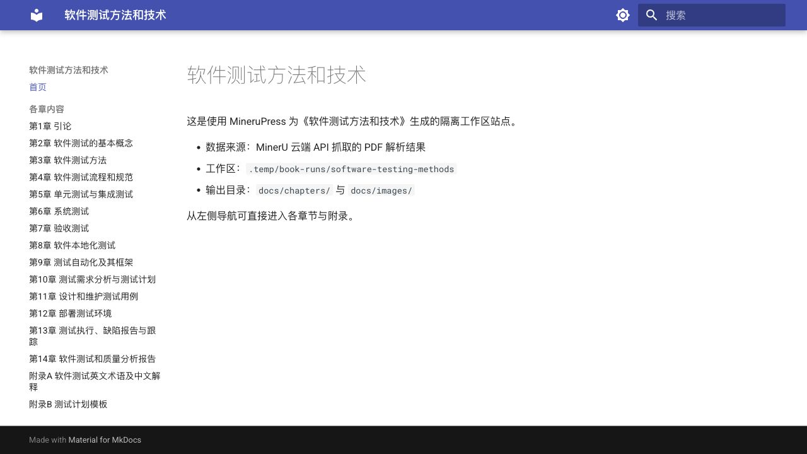

# MineruPress

把 MinerU 解析结果整理成可以发布的 MkDocs Material 图书站点。

MineruPress 适合处理扫描教材、课程讲义、内部手册和长 PDF 知识库迁移：输入 MinerU 生成的 `content_list.json` 与图片，输出按章节拆分的 Markdown、图片资源和可直接部署的静态站点。



英文 README：[docs/README_EN.md](docs/README_EN.md)

## 快速开始

复制模板就是一本新书的起点：

```bash
cp -r book_template/ my-book
cd my-book
minerupress-fetch book.yml
mkdocs serve
```

如果已经有本地 MinerU 输出，把它放到 `resources/mineru/` 后运行：

```bash
minerupress-export book.yml
mkdocs serve
```

标准链路如下：

```text
PDF 或 MinerU API
        |
        v
resources/mineru/*_content_list.json 与图片
        |
        v
docs/chapters/*.md 与 docs/images/
        |
        v
MkDocs Material 图书站点
```

## 解决什么问题

- 长 PDF 经 MinerU 解析后，结果通常是一堆 JSON、图片和松散文本；MineruPress 把它们整理成稳定的图书工程。
- 一本书可以被拆成多个 PDF 分片，导出时仍按同一个逻辑分册连续匹配章节。
- 章节边界优先由标题自动推导，减少手写正则；遇到目录页、附录、项目制教材和中英文标题时也能更稳。
- 导出过程可重复执行，每次重建章节 Markdown 和图片目录，避免旧文件混进新站点。
- 插件系统负责二维码过滤、中西文间距、导出后部署等差异化工作，不把某本书的规则写死进核心代码。

## 安装

当前推荐从 GitHub 安装开发版：

```bash
git clone https://github.com/aronnaxlin/minerupress.git
cd minerupress
pip install -e ".[all]"
```

要求 Python `>=3.11`。如果你的图书工作区还没有 MkDocs：

```bash
pip install mkdocs mkdocs-material
```

可选依赖：

| 依赖组 | 依赖 | 用途 |
|---|---|---|
| `qr` | `opencv-python` | `qr_filter` 二维码图片过滤 |
| `cjk` | `pangu` | `cjk_spacing` 中西文间距处理 |
| `all` | 上面两组 | 常见完整环境 |

## 新书工作区

建议每本书使用独立目录，不要直接把某本书的生成物放进工具链仓库。

```bash
cp -r book_template/ ~/dev/my-book/
cd ~/dev/my-book/
```

模板里已经包含：

- `book.yml`：书籍配置、章节列表、MinerU API 和部署配置。
- `mkdocs.yml`：MkDocs Material 站点配置。
- `.env.example`：敏感环境变量示例。
- `Makefile`：常用导出、校验、构建命令。

常见工作区结构：

```text
my-book/
  book.yml
  mkdocs.yml
  resources/mineru/
  docs/
  site/
```

`resources/`、`docs/`、`site/` 通常是某本书自己的输入和输出，不应提交到 MineruPress 工具链仓库；如果你在独立图书仓库中维护成品站点，再按那个仓库的规则决定是否纳入版本控制。

## 常用命令

本地 MinerU 输出导出：

```bash
minerupress-export book.yml
```

上传 PDF 到 MinerU 云端，拉取结果并导出：

```bash
minerupress-fetch book.yml
```

已有本地输出时，补抓缺失分册后再导出：

```bash
minerupress-export --fetch book.yml
```

分析 MinerU 输出中的正文大标题，生成章节配置草稿：

```bash
minerupress-headings resources/mineru --volume-uid javaweb --format yaml --body-only
```

严格构建站点：

```bash
mkdocs build --strict
```

生成或比对文档指纹：

```bash
python -m minerupress.fingerprint --docs-dir docs --out reports/fingerprints.json
```

## `book.yml` 示例

```yaml
mineru_root: resources/mineru
docs_out: docs
volume_uid: javaweb
toc_max_page: 10
allow_missing_boundaries: false

plugins:
  - qr_filter
  - cjk_spacing

chapters:
  - slug: ch01-overview
    title: 第1章 Web开发概述
  - slug: appendix-a
    title: 附录A 部分习题的解答
```

边界匹配建议：

- 优先只写 `title`。
- MinerU 标题存在别名时加 `aliases`。
- 必须手工控制正则时再写 `start_pattern` 或 `start_patterns`。
- 正式导出保持 `allow_missing_boundaries: false`，避免章节错位后继续生成。

所有相对路径都以 `book.yml` 所在目录为基准解析，所以可以从任意目录执行：

```bash
minerupress-export /path/to/my-book/book.yml
```

## 内置插件

- `qr_filter`：使用 OpenCV 检测并过滤小尺寸二维码图片。
- `cjk_spacing`：使用 `pangu` 为中西文混排补空格，并保护 LaTeX 公式片段。
- `cf_pages`：执行 `mkdocs build --strict` 后部署到 Cloudflare Pages；项目不存在时会自动创建后重试。

自定义插件继承 `ExportPlugin`：

```python
from pathlib import Path
from minerupress import ExportPlugin


class MyPlugin(ExportPlugin):
    def on_image(self, item: dict, img_path: Path | None) -> bool:
        return True

    def on_text(self, item: dict, text: str) -> str:
        return text

    def on_chapter_done(self, slug: str, lines: list[str]) -> list[str]:
        return lines

    def on_export_done(self, docs_out: Path) -> None:
        pass
```

然后在 `book.yml` 中引用：

```yaml
plugins:
  - mypackage.mymodule.MyPlugin
```

## 测试与发布状态

本地验证：

```bash
pip install -e ".[dev]"
pytest
python -m compileall minerupress
```

仓库已配置 GitHub Actions，在 Python 3.11 和 3.12 上运行 `compileall` 与 `pytest`。MineruPress 目前处于 `0.1.0` alpha 阶段，推荐使用 GitHub 开发安装；正式 Release 和 PyPI 分发仍在准备中。

## 文档

- [总览与术语](docs/index.md)
- [快速开始](docs/guide/getting-started.md)
- [实战工作流](docs/guide/workflow-run-a-book.md)
- [配置详解](docs/guide/configuration.md)
- [导出流程](docs/guide/export-pipeline.md)
- [插件系统](docs/guide/plugins.md)
- [云端抓取与部署](docs/guide/cloud-api-and-deploy.md)
- [校验、指纹与排障](docs/guide/validation-and-troubleshooting.md)
- [发布与分发](docs/guide/release.md)

## Agent Skill 安装

仓库内置了可给外部 agent 安装的 Skill：

```text
skills/minerupress/
```

使用者可以从这个仓库获取：

```bash
npx skills add aronnaxlin/minerupress --skill minerupress
```

安装后，agent 可以按同一套流程处理图书配置、MinerU 抓取、章节导出、构建校验、排障和 Cloudflare Pages 部署。维护工具链时，如果流程行为改变，也要同步更新 `skills/minerupress/`。

## 仓库边界

这个仓库是通用工具链，`docs/` 用来放项目文档，`book_template/` 用来放新书模板。某本书的本地工作区、MinerU 输出、站点构建结果和敏感配置应保持隔离，不要提交到这里。

通常不要提交：

- 本地图书工作区目录
- `resources/`
- `site/`
- `reports/`
- `.env`
- `.wrangler/`

## 致谢

- [MinerU](https://github.com/opendatalab/MinerU)
- [MkDocs](https://www.mkdocs.org/)
- [Material for MkDocs](https://squidfunk.github.io/mkdocs-material/)
- [Cloudflare Pages](https://pages.cloudflare.com/)
- [Vercel Agent Skills](https://vercel.com/docs/agent-resources/skills)

## 许可证

Apache License 2.0，见 [LICENSE](LICENSE)。
